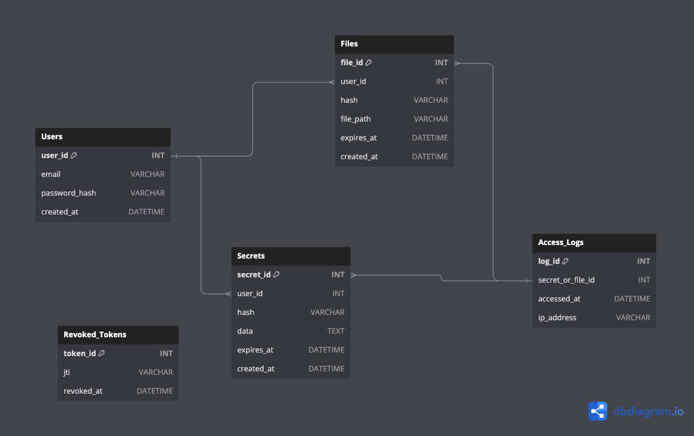

# gosplash

A golang application used to share files and secrets both privately and publicly.

We can login and send the file to another registered user and it will pop up to his homepage.

Public sharing is also supported via secure URLs that are deleted once the time expires or the limit imposed is exceeded.

For sharing the file we need to add a special token facilitated by the user or both users need to be part of the same organization.

## Authors

- [@yelmakioui](https://www.github.com/YasenMakioui)

## Acknowledgements

- [onetimesecret](https://github.com/onetimesecret/onetimesecret)
- [transfersh](https://github.com/dutchcoders/transfer.sh)

## Database Model

The databsae model aims to be as simple as posible to focus on the main purpose of the app.

